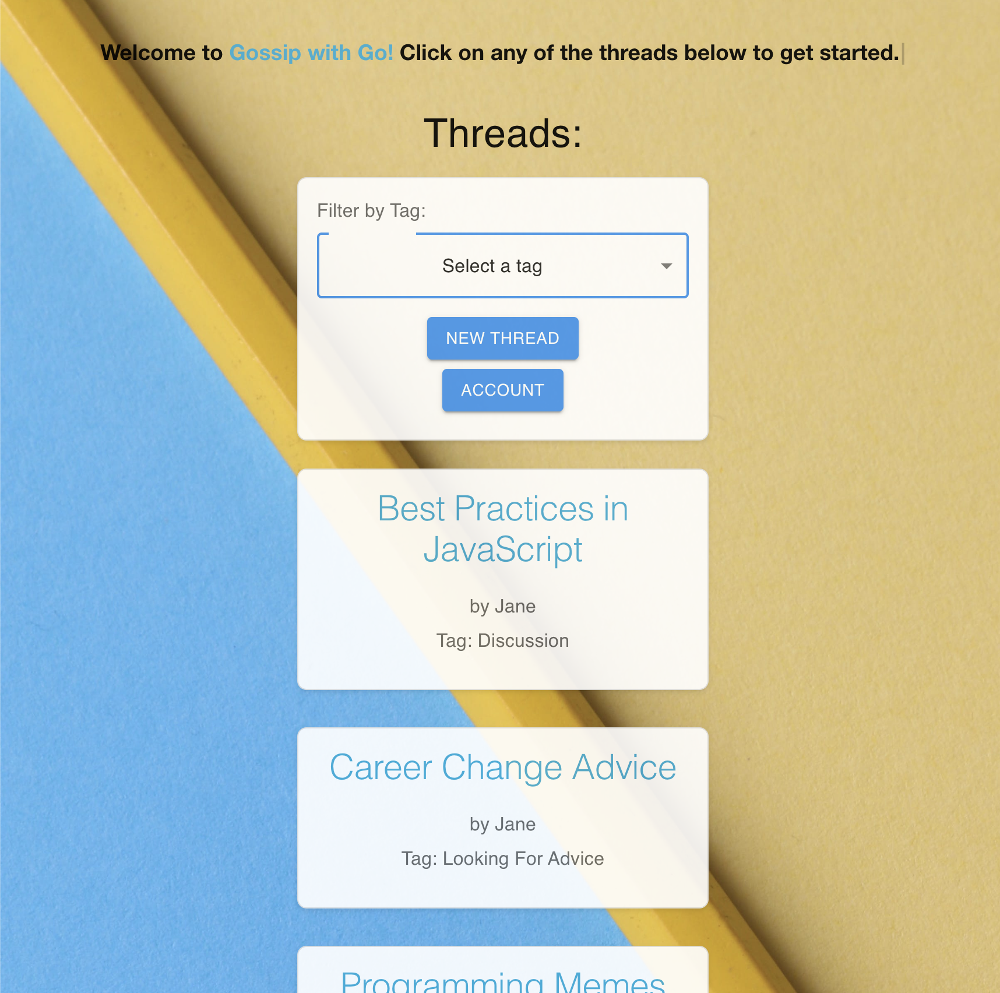

# Gossip with Go 

This is a web forum application which is developed with a Go backend using the Go-Chi framework and a React frontend, and
this is the repository for the frontend. The repository for the backend can be found [here](https://github.com/itstrueitstrueitsrealitsreal/gossip-with-go-be).


## Getting Started

### User Guide
1. The web application is accessible at https://gossip-with-go.vercel.app/, and the user can browse threads without logging in.
Sample threads and posts have been created to simulate a populated forum. 

2. The landing page consists of a list of all the threads, preceded by a component which allows you to filter the threads by tag by using the dropdown menu.
Clicking on the threads will lead to a page with the comments associated with the thread. 

3. The user needs to login or register to create new threads or comments using the dialog which is rendered when clicking the account button.

4. Once the user is logged in, the account button now opens a dialog which allows the user to change their username or password.

5. The user now has the option to create new threads or comments by clicking the new thread button while viewing the list of threads or clicking the new comment button while viewing the specific thread respectively.

6. If the user is logged in and is the original poster of the comment or thread they are viewing, they will also have the option to edit or delete their thread or comment.


### Running the app locally

1. [Fork](https://docs.github.com/en/get-started/quickstart/fork-a-repo#forking-a-repository) this repo.
2. [Clone](https://docs.github.com/en/get-started/quickstart/fork-a-repo#cloning-your-forked-repository) **your** forked repo.
3. Open your terminal and navigate to the directory containing your cloned project.
4. Install dependencies for the project by entering this command:

```bash
yarn install
```

5. Run the app in development mode by entering this command:

```bash
yarn start
```

6. Open [http://localhost:3000](http://localhost:3000) to view it in the browser.
7. You should see a page like this.
   

### Navigating the code

This is the main file structure

```
.
├── README.md
├── build
├── node_modules
├── package.json
├── public
├── src
├── tsconfig.json
├── yarn-error.log
└── yarn.lock
```

Main directories/files to note:

-   `src` usually includes all your source code. That is where most of your functional code will be.
-   `README.md` is a form of documentation about the project. It is what you are reading right now.
-   `package.json` contains important metadata, for example, the dependencies and available scripts in the project.
-   `.eslintrc.js` contains the configuration for ESLint. ESLint is a tool to help enforce code consistency.
-   `.prettierrc.js` contains the configuration for Prettier. Prettier is a tool to help format code.

## Additional Notes

-   This project uses [Typescript](https://www.typescriptlang.org/).
-   The linting and code formatting rules are specified in `.eslintrc.js` and `.prettierrc.js` respectively.
-   The available scripts are in `package.json`.
    Here are some scripts that you are likely to use more often:
    -   `yarn start`
    -   `yarn lint:fix`
    -   `yarn format:fix`

## Acknowledgements

This project was bootstrapped with [Create React App](https://github.com/facebook/create-react-app).
This project uses [MUI](https://mui.com/),
[TypewriterJS](https://github.com/tameemsafi/typewriterjs#readme),
[ESLint](https://eslint.org/), [Prettier](https://prettier.io/).
